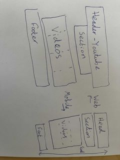
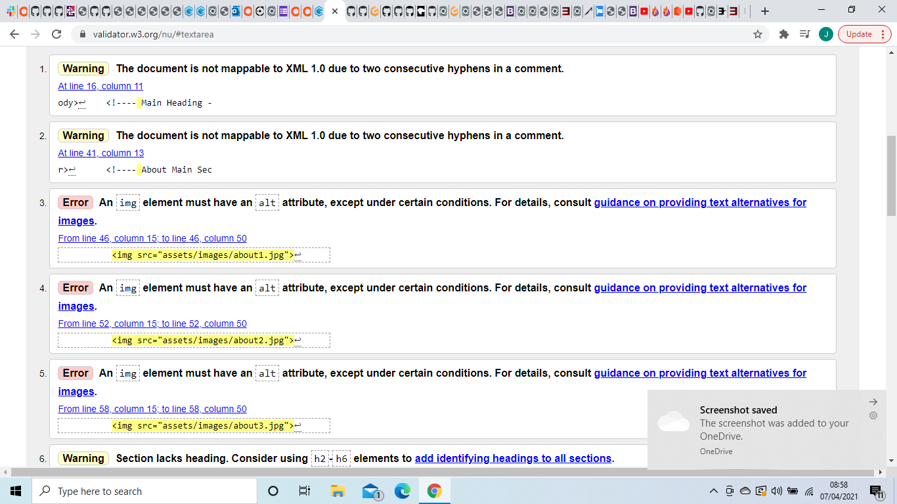

# Fistful of Carbon
This is a website designed for a rock band called Fistful of carbon. It will be disigned to:
1. spread awareness to their youtube channel
2. spread awareness to their social media
3. accumulate revenue from sales
4. help them get more gigs
---
# UX(User Experience)
I need to create a positive user experience. I will achieve this by not overloading the user with infomation, using relevant colours and creating a simple yet exciting layout. I will not include annoying pop-ups or any autoplay.
## Strategy plane
### user stories
I'm looking for a rock band to play at my wedding. I will know from music samples if itll suit my taste, then I will need to book them."Jane Murray"
I'm already a fan and just want to get to know more about them and also maybe buy some merch."Guy Fawks"
I'm new to rock music and am just looking around at various bands.
### conclusion
The site I will build must:
* cater to both fans and newcomers
* preview the bands music
* provide information about the band and its members
* include bookings
* include a shop
## Scope plane
Site will contain 5 pages
1. preview
2. about
3. booking
4. youtube
5. shop
Users can access them using a navigation bar. Javascript cannot be used as I am not knowledgable so the pages will be static, however bootstrap can be used to display models. As I am new I will approach this project with minimalist design. This will help making a responsive page possible.
## Structure plane
* Each page will share a background, footer, header and navbar for simplicity/consisty/ease of access
* Each page will include a collapsable main section for multi-device usability
Navbar will be within the header and list items horizontally in order of importance:
1. preview - lets you know what rock music is and the music style/quality of the music performed.
2. about - Learn about the band, get to know the performers behind the music and their legitamacy.
3. booking - step 3 of the 3 step plan. Users can decide whether to book them or not.
4. youtube - can choose to support the band. page will advertise their youtube channel.
5. shop - further support the band. page will advertise their merch.
## Skeleton plane
I will create a Skeleton/diagram of my pages before I code them.

## Surface plane
### colours
The band colours are blue therefore the rest of the page will reflect that. Conotations of blue include inspiration and freedom so it is fitting. as the blue is bright I will use transparent black backgrounds and also to make the white text visible.
### backgrounds

I will use this image as a background:
If the image fails to load I will use a similar shade of blue as a fallback

I will use this image of the background for the main header.
### other
* font-family; New Tegomin from google fonts will be used with sans-serif as a back up.
* Font icons from fontAwesome will be used as the social media icons are instantly recognized and conveys information quickly
* Images will need to have a good resolusion as they will be stretched
---
#Features
* Site includes 5 pages
* Navigation bar to easily access each page
* Navbar has an underline when active showing which page the user is on
* Navbar and footer list items have hover effects
* Site contains images, audio and index's
* Includes links to social media
* Overlay when hovering on some images to display extra relavent information
* 2 unique modals
* Text will adjust with screen size for readability
* Site will structure can change depending on screen size
## Potential features in the future
* submit button will not work unless form data is filled
* submit button will have functionality
* store section can be expanded
* images could be edited to fit the color/style of the page more
* fixed header with a dropdown menu to appear when using a mobile device
---
# Technologies used
* html-structure of the page
* css-styling of the page
* bootstrap-used for modal/pop ups
* FontAwesome-used to display icons
* GoogleFonts-used for text styling
* replit-used for proto-types and Testing
* git-version control
* gitpod-creating files and writing code
* github-storing the collective files
* dev-tools- testing
---
# testing

temporary borders were used to visually test where things were positioning and to aid me in building the site
## Post completion Testing
* Clicked on every link combination on the navbar to ensure every page had 4 working internal links
* clicked on every external link on the footer of all 5 html Files
* clicked each link within the shop page. closable modal appears for all
* Submit button withing the booking page opens a closable modal
* Tested screen responsivness on Moto G4, Galaxy S5, Pixel 2, Pixel 2 XL, Iphone 5/SE, Iphone 6/7/8, Iphone 6/7/8 plus, Iphone X, Ipad, Ipad pro, Surface Duo and Galaxy fold using dev tools on chrome.
* Opened link on google Chome, microsoft edge and booking
* Tested visability of text at multiple screen sizes using dev-tools
## Issues
* git was difficult to use at first
* audio files don't load in the preview of gitpod for media
* some images got distorted easily when streched therefore page height had to be adjusted or a higher resolution image was to replace it
## Validater

I had my css code validated here:[https://jigsaw.w3.org/css-validator/]{https://jigsaw.w3.org/css-validator/}
I had all my html code validated here:[https://validator.w3.org/]{https://validator.w3.org/}
I corrected all errors/mistakes. Now all code is valid
---
# Deployment
---
# Credit
##I mages
Images were all found through google images
## Video Files
All downloaded from here:[https://www.bensound.com](https://www.bensound.com)
## Tutorials
CodeInstitude website
learnt to fade background: [https://www.youtube.com/watch?v=BNrTQzKWyDo](https://www.youtube.com/watch?v=BNrTQzKWyDo)
## inspiration
Eminems merch store was very visually appealing and efficient so I adopted a similar design[https://shop.eminem.com/](https://shop.eminem.com/)
